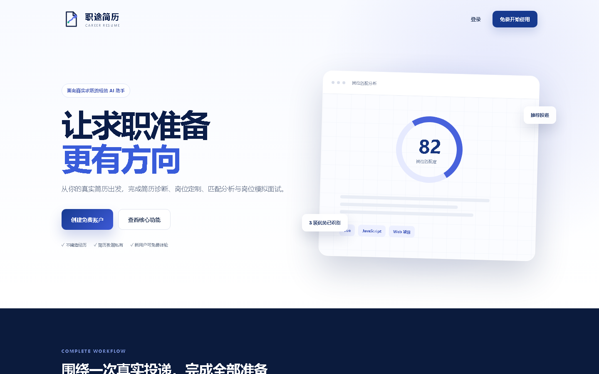
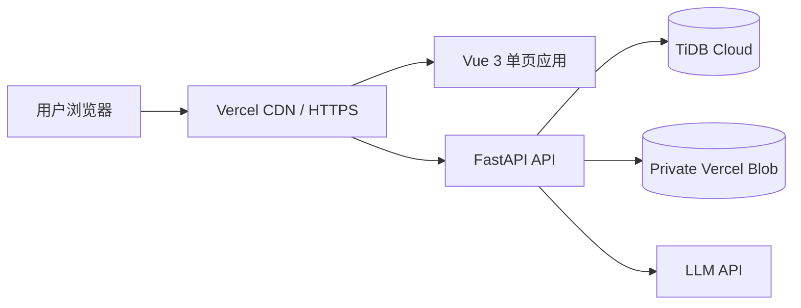
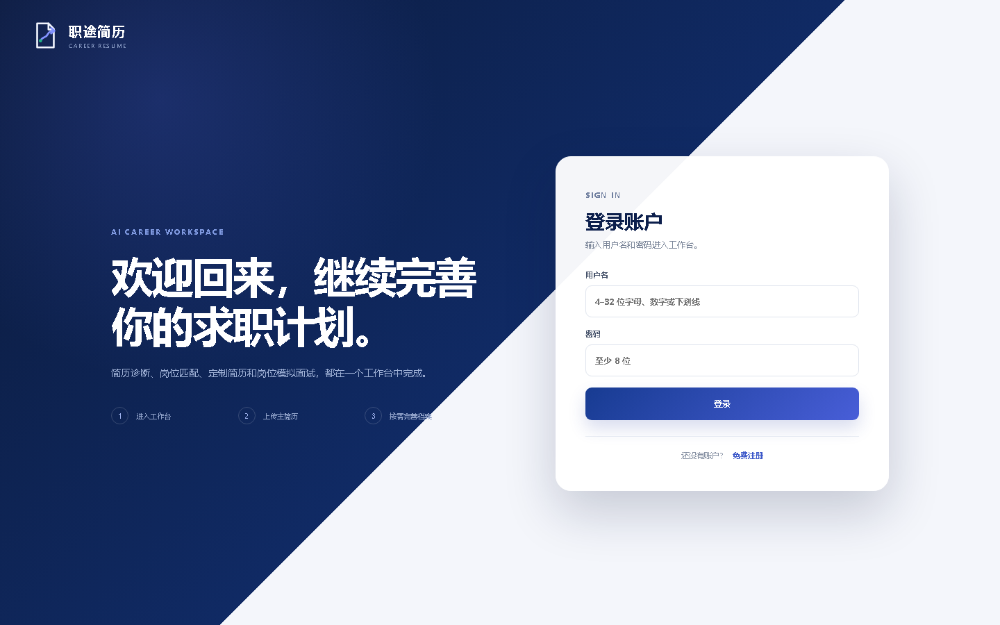

# 职途简历 · AI 求职助手

[](https://www.zhitucv.online)


[](LICENSE)

职途简历是一套面向真实求职流程的全栈 AI 应用。它从用户的真实简历出发，将简历诊断、岗位匹配、岗位定制简历和模拟面试串成一个完整工作流，并支持将定制结果导出为可直接使用的 PDF 或 Word 简历。

**在线体验：[https://www.zhitucv.online](https://www.zhitucv.online)**

> 当前为个人作品展示与非商业试用版本。请勿在公开测试中上传身份证号、银行卡号等与求职无关的高敏感信息。



## 核心功能

| 模块 | 能力 |
| --- | --- |
| 我的简历 | 上传 PDF/DOCX、解析文字、人工确认、替换与私有存储 |
| AI 简历诊断 | 综合评分、维度评分、优势、问题和逐条修改建议 |
| 岗位匹配 | 根据简历与 JD 输出匹配度、证据、缺失项和投递建议 |
| 岗位定制简历 | 在不编造经历的前提下改写内容，逐条确认并保存独立版本 |
| 成品导出 | 按统一模板实时预览，导出 A4 PDF 或可继续编辑的 Word |
| AI 模拟面试 | 根据岗位生成 5 道问题，逐题反馈并生成综合报告 |
| 工作台 | 展示主简历状态，并与最新诊断得分实时联动 |

## 项目亮点

- **完整产品闭环**：不是单一聊天页面，而是从简历录入到面试训练的连续业务流程。
- **事实约束**：AI 输出需要通过结构校验、原文引用校验和新增事实拦截，降低虚构经历的风险。
- **可用成品**：岗位定制结果可以继续编辑，并导出为排版完整的 PDF/Word 简历。
- **隐私与安全**：使用强密码哈希、HttpOnly Cookie、CSRF 校验、Host 白名单、HSTS 和接口频率限制。
- **真实云端部署**：前端与 API 部署在 Vercel，数据保存到 TiDB Cloud，原始文件保存到 Private Vercel Blob。
- **可扩展计费基础**：AI 请求日志已记录功能类型、状态、Token 用量和耗时；后续可增加次数余额、赠送流水与订单模块。

## 系统架构



请求由同一域名进入前端和后端。API Key、数据库密码和文件访问令牌只保存在服务端环境变量中，不会发送到浏览器或提交到 Git。

## 技术栈

| 层级 | 技术 |
| --- | --- |
| 前端 | Vue 3、TypeScript、Vite、Pinia、Vue Router、Axios |
| 后端 | Python 3.12、FastAPI、Pydantic、SQLAlchemy、Alembic |
| 数据库 | MySQL 协议、TiDB Cloud |
| 文件与导出 | Vercel Blob、PyMuPDF、python-docx、ReportLab |
| AI | OpenAI-compatible Chat Completions API、结构化 JSON 校验 |
| 部署 | Vercel Functions（香港区域）、Vercel CDN、GitHub 自动部署 |

## 页面预览

### 登录与账户系统



登录后默认进入工作台；只有在首次使用 AI 功能时，系统才会引导用户完善求职档案。

## 目录结构

```text
.
├─ frontend/            Vue 3 前端
├─ backend/             FastAPI、数据模型、迁移与测试
├─ api/                 Vercel Python 函数入口
├─ deploy/              自有服务器反向代理示例
├─ docs/images/         README 展示图片
├─ vercel.json          Vercel 构建、路由与运行区域配置
└─ Dockerfile           容器部署入口
```

## 本地运行

### 环境要求

- Python 3.12+
- Node.js 20+
- pnpm 11+
- MySQL 8 或兼容数据库

### 启动后端

```powershell
cd backend
Copy-Item .env.example .env
python -m venv .venv
.\.venv\Scripts\python -m pip install -e ".[dev]"
.\.venv\Scripts\python -m alembic upgrade head
.\.venv\Scripts\python -m uvicorn app.main:app --reload
```

后端默认运行在 `http://127.0.0.1:8000`。请先在 `backend/.env` 中填写本地数据库参数，并为 `AI_CAREER_AUTH_SECRET` 设置不少于 32 位的随机值。

### 启动前端

```powershell
cd frontend
pnpm install
pnpm dev
```

前端默认运行在 `http://127.0.0.1:5173`。

## 测试与构建

```powershell
cd backend
.\.venv\Scripts\python -m pytest

cd ..\frontend
pnpm build
```

## 部署

生产环境使用 GitHub 与 Vercel 自动部署。具体变量、TiDB 和 Private Blob 配置见 [VERCEL_DEPLOYMENT.md](VERCEL_DEPLOYMENT.md)。如需部署到自有服务器，可参考 [DEPLOYMENT.md](DEPLOYMENT.md)；Render 配置作为可选部署方案保留在 [RENDER_DEPLOYMENT.md](RENDER_DEPLOYMENT.md)。

生产密钥必须通过部署平台的环境变量保存。不要提交 `.env`、数据库连接地址、用户上传文件或任何真实 API Key。

## V1.0 边界与路线图

当前版本暂不包含支付、手机号验证码登录和求职记录。后续计划：

- 管理员数据面板与访问分析
- AI 免费次数、余额与邀请赠送流水
- 支付订单与回调
- 更多简历模板
- OCR 扫描版简历识别

## 参与项目

欢迎提交 Issue 和 Pull Request。提交前请阅读 [CONTRIBUTING.md](CONTRIBUTING.md) 与 [SECURITY.md](SECURITY.md)，并确保测试数据不包含真实个人信息或密钥。

## License

本项目基于 [MIT License](LICENSE) 开源。
