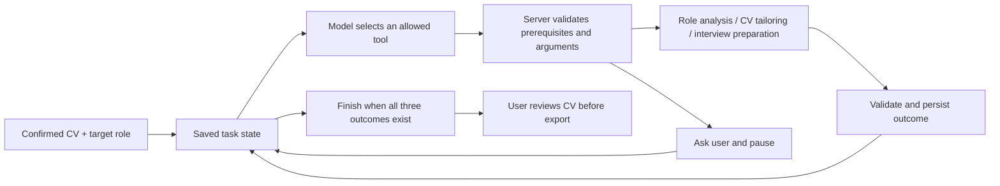
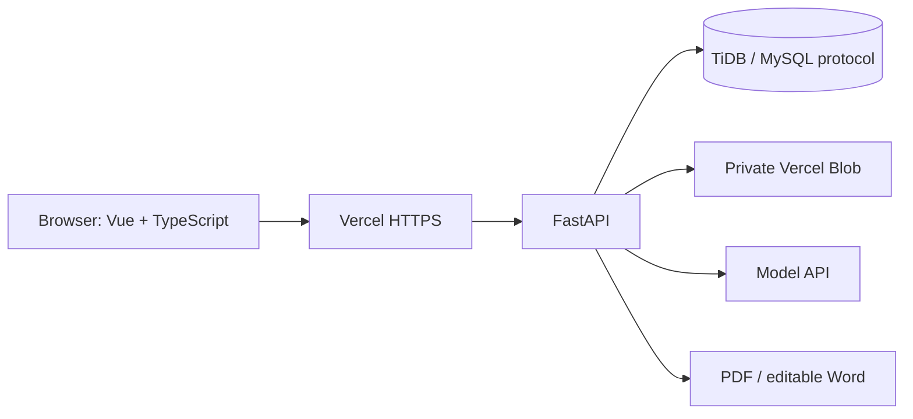
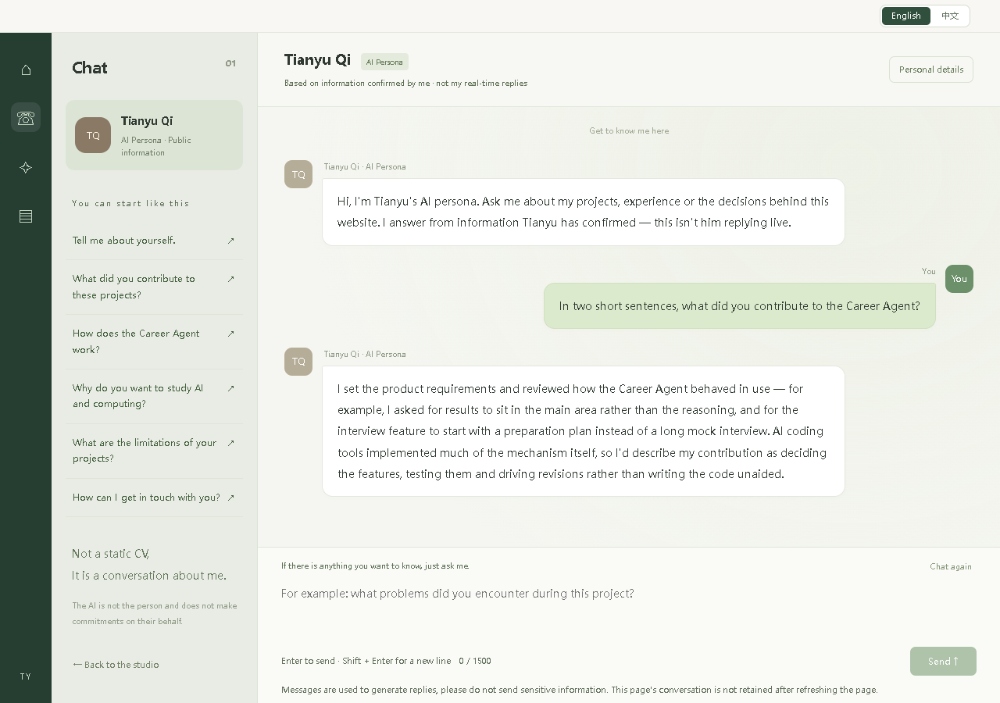
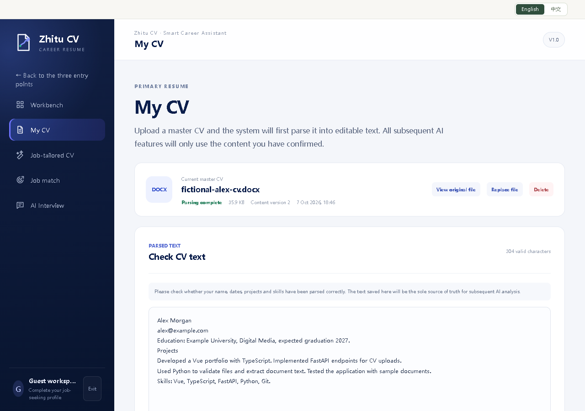

# Tianyu Qi · Applied AI Studio

**A personal portfolio of three connected AI application experiences.**

[Live portfolio](https://www.zhitucv.online/) · [Recorded example](https://www.zhitucv.online/demo) · [Project brief (PDF)](https://www.zhitucv.online/portfolio/tianyu-qi-project-brief.pdf) · [中文说明](README.zh-CN.md)


## What is here?

| Experience | Purpose | Explore |
| --- | --- | --- |
| **Career Agent** | A bounded tool-calling workflow that delivers role analysis, a tailored CV and interview preparation. | [Case study](https://www.zhitucv.online/projects/career-agent) · [App](https://www.zhitucv.online/agent) |
| **AI Persona** | Model-generated conversation about Tianyu's confirmed public experience, with explicit factual and privacy boundaries. | [Case study](https://www.zhitucv.online/projects/ai-persona) · [Chat](https://www.zhitucv.online/me) |
| **Zhitu CV** | Individual CV parsing, analysis, job matching, tailoring, PDF / Word export and optional mock-interview tools. | [Case study](https://www.zhitucv.online/projects/zhitu-cv) · [Workspace](https://www.zhitucv.online/app) |

These are complementary experiences in **one codebase**, not three unrelated systems. The CV toolkit provides reusable capabilities; the Agent coordinates them. The Persona is a separate conversational interface to curated public information.

The site defaults to British English, with a persistent Chinese language switch. Existing user documents are not silently translated. This is a personal portfolio and non-commercial trial, not a recruitment service or a claim of hiring outcomes.

## Quick review: no sign-up or personal documents needed

Open the [recorded demonstration](https://www.zhitucv.online/demo). It contains a fictional CV and employer, a real saved model response, its executed tool names, and actual PDF / Word exports. It is clearly marked as **read-only and pre-generated**. Opening it does not create an account, consume model tokens or expose a visitor's private workspace.

The live tools establish an isolated guest session. Guest documents cannot be recovered after the session expires or its cookies are cleared; download important results. Do not upload sensitive documents just to evaluate the portfolio.

## My contribution and development approach

I am Tianyu Qi, a Digital Media Technology undergraduate at Fujian Normal University, expecting to graduate in 2027. I set the product requirements and priorities, tried the application, identified issues, reviewed successive versions and drove the direction of iteration and delivery.

Concrete decisions I proposed include:

- Rejecting near-identical CV rewrites instead of presenting cosmetic edits as useful advice.
- Collecting genuine experience beyond a one-page CV to support role-specific selection.
- Giving completed results the main workspace, with a clear loading state instead of a verbose reasoning stream.
- Generating interview preparation first and leaving a mock interview as the user's choice.
- Turning text-only exports into formatted CVs, including editable Word documents.
- Removing unreliable recruitment-link reading and retaining manual job entry.

**AI coding tools performed much of the implementation.** My contribution is product direction, requirements, hands-on evaluation and iterative delivery. The stack below describes the application, not a claim that I independently authored every component or trained the underlying model.

## How the Career Agent works


```mermaid
flowchart LR
  U[Confirmed CV + target role] --> S[Saved task state]
  S --> P[Model selects an allowed tool]
  P --> G[Server validates prerequisites and arguments]
  G --> A[Role analysis / CV tailoring / interview preparation]
  G --> Q[Ask user and pause]
  Q --> S
  A --> V[Validate and persist outcome]
  V --> S
  S --> F[Finish when all three outcomes exist]
  F --> H[User reviews CV before export]
```

- The model chooses among five actions. The server determines which are currently allowed.
- Completed outcomes are persisted; revision checks guard concurrent execution of a task version.
- Failed steps can be retried. Closing the browser does not launch subsequent steps in the background.
- Structured schemas, source checks and conservative change filtering constrain outputs. They reduce risk but do not prove every statement is correct.
- If a full job description is missing, advice is labelled general and is not presented as verified company requirements.

Implementation: [tool selection](backend/app/ai/agent.py), [execution and state](backend/app/api/routes/agent.py), [workflow tests](backend/tests/test_agent.py).

## Architecture


```mermaid
flowchart LR
  B[Browser: Vue + TypeScript] --> V[Vercel HTTPS]
  V --> API[FastAPI]
  API --> DB[(TiDB / MySQL protocol)]
  API --> FILE[Private Vercel Blob]
  API --> LLM[Model API]
  API --> OUT[PDF / editable Word]
```

| Layer | Technology |
| --- | --- |
| Interface | Vue 3, TypeScript, Vite, Pinia, Vue Router |
| API | Python, FastAPI, Pydantic, SQLAlchemy, Alembic |
| Data | MySQL-compatible database, TiDB Cloud in production |
| Documents | PyMuPDF, python-docx, ReportLab |
| Model | Server-side Chat Completions API with tool calling and structured validation |
| Hosting | Vercel Functions and private Blob storage; GitHub-linked deployment |

Model keys, database credentials and storage tokens are server-side configuration. Private uploads and guest cookies must never be committed or included in screenshots.

## Verification and limitations

See [evaluation notes](docs/EVALUATION.md) for the scope and distinction between automated tests and model-quality evaluation. Tests cover guest isolation, CSRF, invalid tool calls, workflow order, state conflicts, recovery, output validation and document export.

Most automated tests use controlled model responses. A passing suite is **not a model accuracy score**. The saved demonstration is one synthetic example, not a benchmark, measured user impact or hiring success statistic.

Known boundaries:

- No model training, fine-tuning, autonomous application submission or recruitment-site crawling.
- The Persona uses curated context, not undocumented vector retrieval. Valid fact identifiers alone cannot prove complete semantic grounding.
- No scanned-document OCR; a match score is a heuristic, not a hiring probability.
- Text-based source checks can reject useful paraphrases or miss unsupported claims; human review remains important.
- An interrupted running step may require waiting for its ten-minute lease to expire. Exactly-once execution across all tool writes is not guaranteed.
- A future extension would compare outputs across a documented CV / role evaluation set and a simpler baseline. That experiment is not yet completed.

## Local development

Requirements: Python 3.12+, Node.js 20+, pnpm 11+, and MySQL 8 or a compatible database.

```powershell
cd backend
Copy-Item .env.example .env
python -m venv .venv
.\.venv\Scripts\python -m pip install -e ".[dev]"
# Configure the local database and server-side secrets in .env.
.\.venv\Scripts\python -m alembic upgrade head
.\.venv\Scripts\python -m uvicorn app.main:app --reload
```

In another terminal:

```powershell
cd frontend
pnpm install
pnpm dev
```

The interface runs at `http://127.0.0.1:5173`; the API runs at `http://127.0.0.1:8000`.

```powershell
cd backend
.\.venv\Scripts\python -m pytest -q
cd ../frontend
pnpm build
```

[Vercel configuration](VERCEL_DEPLOYMENT.md) · [Self-hosting](DEPLOYMENT.md) · [Security reporting](SECURITY.md) · [Contributing](CONTRIBUTING.md)

## Screenshots

Screenshots below are actual interfaces. Career data belongs to a fictional test applicant.




## Licence

Code is released under the [MIT licence](LICENSE). Do not represent Tianyu's personal biography or public contact information as your own when reusing the application.
