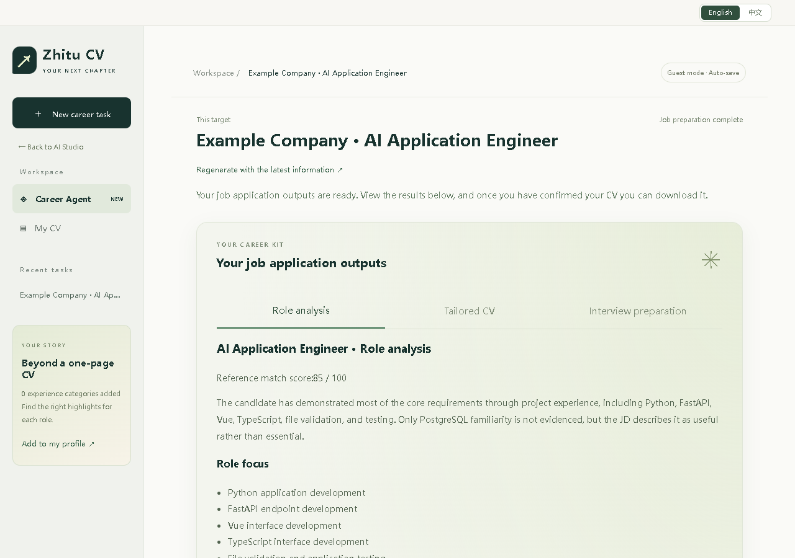

# 齐天宇 · AI 应用作品集

[在线作品](https://www.zhitucv.online/) · [完整示例](https://www.zhitucv.online/demo) · [英文项目简介 PDF](https://www.zhitucv.online/portfolio/tianyu-qi-project-brief.pdf) · [English](README.md)

一套代码中的三个互补体验：职途简历提供基础工具，求职 Agent 组织任务流程，AI 分身通过对话介绍本人公开经历与项目决策。网站默认英文，可切换中文并记住选择。



## 三个模块

| 模块 | 能力 | 介绍 |
| --- | --- | --- |
| 求职 Agent | 通过有边界的工具调用，完成岗位分析、定制简历、面试准备；保存状态并允许失败重试。 | [项目介绍](https://www.zhitucv.online/projects/career-agent) |
| AI 分身 | 根据整理后的公开事实，由模型自然组织对话，支持追问并明确事实与隐私边界。 | [项目介绍](https://www.zhitucv.online/projects/ai-persona) |
| 职途简历 | 简历解析、诊断、岗位匹配、逐条确认修改、PDF / Word 导出及可选模拟面试。 | [项目介绍](https://www.zhitucv.online/projects/zhitu-cv) |

## 无需账号即可浏览成果

[预生成示例](https://www.zhitucv.online/demo) 使用虚构申请者 Alex Morgan、Example University 和 Example Company，展示实际应用调用模型生成并保存的结果。示例为只读，不调用模型、不创建访客身份，也不修改真实用户资料。包含实际 PDF 与 Word 导出。

实际应用会建立隔离的访客身份。清除 Cookie 或会话过期后，访客资料无法找回，请及时下载重要文件。为浏览作品，无需上传敏感个人资料。

## 本人贡献与开发方式

我叫齐天宇，在福建师范大学学习数字媒体技术，预计 2027 年毕业。我提出需求并决定功能优先级，亲自试用、发现问题，评审迭代结果并推动交付。

我的具体决策包括：

- 过滤只改标点或几乎重复原文的无效建议。
- 保存简历之外的真实经历，为不同岗位提供可选择的材料。
- 将成果移到工作区主要位置，用等待提示替代冗长过程输出。
- 先生成面试准备方案，由用户自主决定是否开始模拟面试。
- 提供模板参考，要求成品排版与可继续编辑的 Word 导出。
- 移除实际体验不稳定的招聘链接读取，保留手动输入岗位。

大量代码实现由 AI 编程工具辅助完成。这里展示的是产品方向、需求、实际评审与迭代交付贡献，不代表全部组件由我独立编写，也不代表我训练了底层模型。

## 实现与验证

前端采用 Vue 3、TypeScript、Vite；后端采用 FastAPI、Pydantic、SQLAlchemy。生产环境使用 Vercel、TiDB Cloud 和私有 Blob 文件存储。

Agent 根据已完成结果，在岗位分析、简历定制、面试准备、询问用户和完成任务中选择下一步。服务端限制前置条件、校验参数并保存状态；版本检查用于限制重复执行。关闭浏览器后不会启动后续步骤。

详见 [验证记录](docs/EVALUATION.md)、[Agent 说明](docs/AGENT.md) 和 [完整英文 README](README.md)。自动化测试大多使用受控模型回复；测试通过不等于模型准确率、用户效果或录用成功率。当前不包含模型训练、向量检索、自动投递、招聘网站抓取或扫描文档 OCR。事实检查与人工确认用于降低风险，不能保证绝对正确。

## 本地运行与部署

需要 Python 3.12+、Node.js 20+、pnpm 11+ 和 MySQL 8 或兼容数据库。

```powershell
cd backend
Copy-Item .env.example .env
python -m venv .venv
.\.venv\Scripts\python -m pip install -e ".[dev]"
# 在 .env 中配置数据库与服务端密钥
.\.venv\Scripts\python -m alembic upgrade head
.\.venv\Scripts\python -m uvicorn app.main:app --reload
```

另开终端：

```powershell
cd frontend
pnpm install
pnpm dev
```

前端默认 `http://127.0.0.1:5173`，后端默认 `http://127.0.0.1:8000`。后端测试使用 `python -m pytest -q`，前端构建使用 `pnpm build`。

[Vercel 部署](VERCEL_DEPLOYMENT.md) · [自有服务器部署](DEPLOYMENT.md) · [安全说明](SECURITY.md) · [参与贡献](CONTRIBUTING.md)

不要提交密钥、真实用户文件或会话信息。项目代码基于 [MIT License](LICENSE)；复用代码时不得冒用本人经历或身份。
